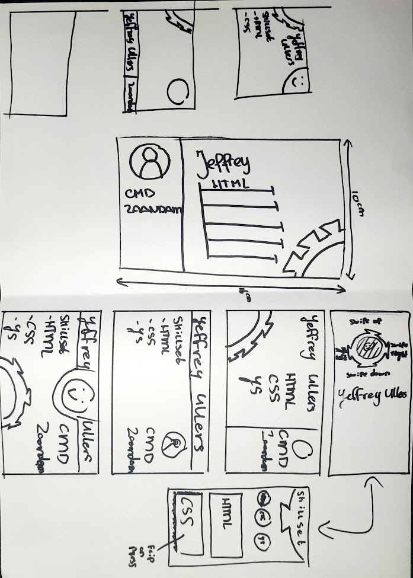
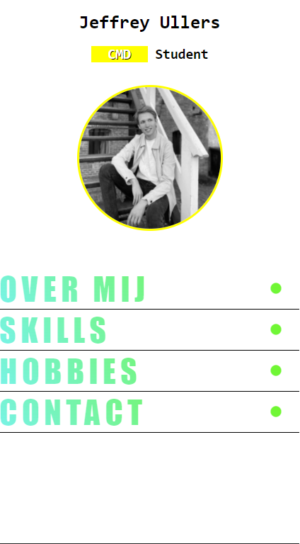
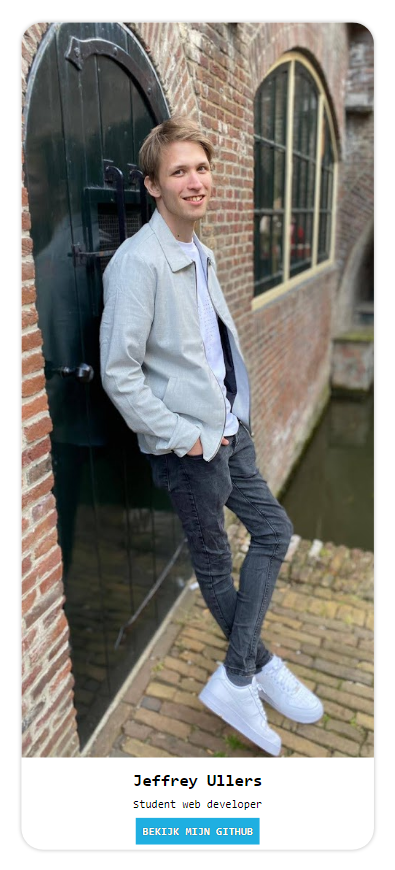

    

## 💬 Quicklinks naar verslag

[Week 1](#week1) -
[Week 2](#week2) -
[Week 3](#week3) -
[Week 4](#week4)

##

    

## 💬 Intro | Visitekaartje
In deze week heeft iedereen gewerkt aan het maken van een visitekaartje. Mijn visitekaartje is te vinden op deze pagina

Alhoewel de opdracht vrij simpel leek, verliep dit toch niet zonder enige slag of stoot. Vanaf dag 1 werd ons al verteld dat wij bij dit vak niet meer met javascript, classes en id's mochten werken als uitdaging. Dus de uitdaging lag bij het experimenteren met selectoren. Wij begonnen met het schetsen van ideeen voor andere klasgenoten.

De persoon die mijn kaartje mocht ontwerpen koos ervoor om tandwielen in mijn ontwerp te plaatsen, gezien het feit dat ik best technisch ben.
### Screenshots

Op dit blad zie je in het groot het ontwerp dat voor mij getekend was. 
daarboven en onder zijn schetsen die ik heb gemaakt om te itereren op dit ontwerp.

Uiteindelijk koos ik ervoor om het tandwiel in het midden te plaatsen. 
Het tandwiel wou ik graag centraal houden omdat dit volgens mijn klasgenoot vond dat dat
bij mij hoorden.

Ik ben hier een tijd mee aan de slag gegaan maar kwam er niet uit hoe ik het tandwiel
kon maken. Ik dacht vanaf het begin al na hoe ik het zou laten draaien en hoe ik uberhaupt
de content zou plaatsen aangezien ik eigenlijk te weinig ruimte had ervoor.

Dus koos ik ervoor om het ontwerp compleet om te gooien, het tandwiel wou ik als klein
detail toevoegen aan het ontwerp maar wist niet niet hoe. Ik begon met het maken van mijn
tweede versie van het visitekaartje.

Na heel even spelen met de code kwam ik hierop uit. Echter vond ik dit simpelweg niet mooi
en wist ik niet hoe ik dit mooier kon maken. Pinterest deed er niet heel goed op.

Hierdoor besloot ik over te stappen op het maken van een kaart. Dit had helemaal niets
te maken met het tandwiel maar het was iets wat ik wou maken. Echter na het maken van het
ontwerp liep ik al gouw vast op hoe ik het draaien / verschuiven van het kaartje
werkend kon krijgen. na veel googlen heb ik het soort van werkend gekregen.

[Zie het visitekaartje](https://gekkeboyjeff.github.io/visitekaartje/)

    

