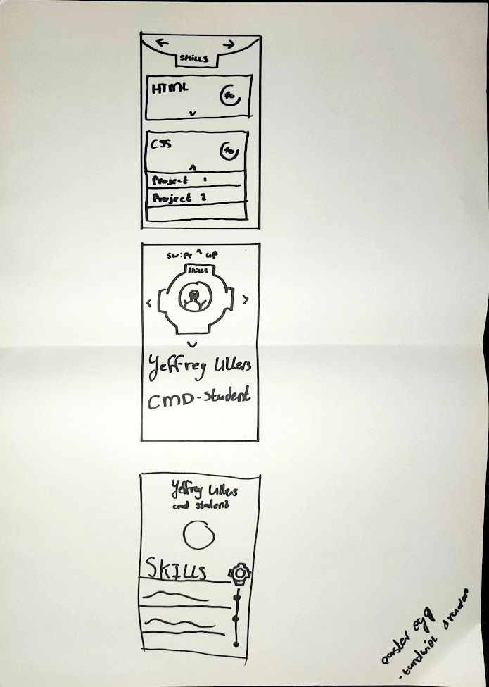

<div>
    <a href="#">
    
    </a>
</div>

## 💬 Quicklinks naar verslag

[Week 1](#week1) -
[Week 2](#week2) -
[Week 3](#week3) -
[Week 4](#week4)

##

<div id="week1">
    <a href="#">
    
    </a>
</div>

## 💬 Intro | Visitekaartje
In deze week heeft iedereen gewerkt aan het maken van een visitekaartje. Mijn visitekaartje is te vinden op deze pagina

Alhoewel de opdracht vrij simpel leek, verliep dit toch niet zonder enige slag of stoot. Vanaf dag 1 werd ons al verteld dat wij bij dit vak niet meer met javascript, classes en id's mochten werken als uitdaging. Dus de uitdaging lag bij het experimenteren met selectoren. Wij begonnen met het schetsen van ideeen voor andere klasgenoten.

De persoon die mijn kaartje mocht ontwerpen koos ervoor om tandwielen in mijn ontwerp te plaatsen, gezien het feit dat ik best technisch ben.
### Screenshots


Op dit blad zie je in het groot het ontwerp dat voor mij getekend was. 
daarboven en onder zijn schetsen die ik heb gemaakt om te itereren op dit ontwerp.





Uiteindelijk koos ik ervoor om het tandwiel in het midden te plaatsen. 
Het tandwiel wou ik graag centraal houden omdat dit volgens mijn klasgenoot vond dat dat
bij mij hoorden.

Ik ben hier een tijd mee aan de slag gegaan maar kwam er niet uit hoe ik het tandwiel
kon maken. Ik dacht vanaf het begin al na hoe ik het zou laten draaien en hoe ik uberhaupt
de content zou plaatsen aangezien ik eigenlijk te weinig ruimte had ervoor.

Dus koos ik ervoor om het ontwerp compleet om te gooien, het tandwiel wou ik als klein
detail toevoegen aan het ontwerp maar wist niet niet hoe. Ik begon met het maken van mijn
tweede versie van het visitekaartje.


Na heel even spelen met de code kwam ik hierop uit. Echter vond ik dit simpelweg niet mooi
en wist ik niet hoe ik dit mooier kon maken. Pinterest deed er niet heel goed op.

Hierdoor besloot ik over te stappen op het maken van een kaart. Dit had helemaal niets
te maken met het tandwiel maar het was iets wat ik wou maken. Echter na het maken van het
ontwerp liep ik al gouw vast op hoe ik het draaien / verschuiven van het kaartje
werkend kon krijgen. na veel googlen heb ik het soort van werkend gekregen.


[Zie het visitekaartje](https://gekkeboyjeff.github.io/web-app-from-scratch-2122/week1/visitekaartje/)

##Teampagina: Geekotron

De hele klas is verdeeld in kleine groepjes zodat de leerlingen elkaar leren kennen. Ik werd ingedeeld bij Yolanda, Tim, Farrahton en Jeany. De groep gaat gelukkig goed met elkaar om en wellicht praten we iets te veel, maar dat zijn overige details.

Als groep kregen wij de opdracht om een groepspagina te maken. Deze moest doorlinken naar onze visitekaartjes.

Als eerst hebben we als groep ge-brainstormed over hoe wij de pagina eruit wouden laten zien. Hiervoor hebben wij een aantal schetsen gemaakt.


Hieruit hebben wij uiteindelijk een nieuw ontwerp gemaakt, namelijk;


Wij hebben ondervonden dat wij allemaal wel iets nerdy/geeky hebben en pokemon/gamen leuk vinden. Daarom hadden wij besloten om een teampagina te maken die gebaseerd is op Pokemon.
Hieronder is een eerste versie te zien waarin wij aan het spelen waren met positionering en het draaien van de kaarten


Nadat wij de kaarten konden laten draaien en de stijling een beetje op orde hadden konden wij een 2de versie samenvoegen. Wij hadden namelijk alle onderdelen van de pagina in kleine taken verdeeld zodat iedereen wat kon doen eraan.


[Zie de teampagina](https://gekkeboyjeff.github.io/web-app-from-scratch-2122/week1/Geekotron/)

<div id="week2">
    <a href="#week1">
    
    </a>
</div>

## Oefenen met Api's

~Sneakpeak~

Voordat ik me direct probeerde te verdiepen in de API van de opdracht, heb ik de oefenopdracht die sommige klasgenoten hadden gekregen zelf ook gedaan.

De oefenopdracht bestond uit het "scrapen" van afbeeldingen van giphy. je kreeg standaard uiterlijk 10 afbeeldingen die je kon oproepen vanwege een limiet. Dat vond ik problematisch omdat ik een ander idee in gedachten had toen ik dit zelf maakte. Maar goed het lukte me al vrij snel om verschillende types aan data op te halen en weer te geven:

Ik heb wel even moeite gehad met het uitzoeken hoe ik dat limiet kon aanpassen. Gelukkig kwam ik erachter dat je het limiet tot 50 kan uitbreiden door dit zoals eerder benoemd in de url zelf aan te passen.

```js
'https://api.giphy.com/v1/gifs/search?q=pokemon&api_key=jhcL7QPGb2ObrOHw1dEJuL9w2j71zfEk&limit=50'
```

Hetgene wat ik hierna wou doen was echter moeilijker. Ik wou namelijk knoppen maken om naar een volgende en vorige pagina te gaan. Ik las online wel dat mensen praatte over een offset maar dat zei me eigenlijk helemaal niets. Vanuit de data uit de API zag ik ook telkens 'pages' staan maar daar kon ik simpelweg niets over vinden. Ik was op een gegeven moment aan het opzoeken hoe ik die offset kon toepassen. Het heeft even geduurd voordat ik erachter kwam dat je dit dus ook in de url moet plaatsen. Maar goed dan was ik er nog niet. Ik moest de waarde in de urlnamelijk kunnen aanpassen. 

```js
var endpoint = 'https://api.giphy.com/v1/gifs/search?q=pokemon&api_key=jhcL7QPGb2ObrOHw1dEJuL9w2j71zfEk&limit=50&offset='
var offset = 0
```

dus ik heb de variabel aangemaakt (offset) die standaard op 0 staat. en die verander ik even later in mijn code.

Het inladen van de data ging gelukkig vrij gemakkelijk, daar heb ik weinig moeite bij gehad. Zoals je hieronder ziet loopt de code al iets voor op het 'pagineren' maar daar kom ik zo.

```js
// 2. the story
getData()
// 3. functions
function getData() {
    // 1. variables (aka bindings), on top of local scope
    const list = document.querySelector('body ul')
    // 2. the story
    fetch(endpoint + offset) // get data asynchronously
        .then(function(response){
            return response.json() // stream
        })
        .then(function(giphies){
            //console.log(giphies)
            for (var i = 0; i < 50; i++){
                giphdata = giphies.data;
                list.insertAdjacentHTML('beforeend', 
                `<li><a href="${giphdata[i].bitly_url}">
                    
                    <h2>${giphdata[i].title}</h2>
                    <a href="${giphdata[i].source}">Source</a>
                    </a></li>`) 
            } 
        })
}
```

Ik heb echter wel heel lang zitten strugglen met het toepassen van de offset in de url. maar goed uiteindelijk bleef het antwoord heel simpel, namelijk;

```js
document.querySelector('.next').addEventListener("click", function() {
        list.innerHTML = ''
        offset = offset + 50
        getData()
})

document.querySelector('.previous').addEventListener("click", function() {
    if(offset == 0){
        console.log('offset kan niet in de min');
    }else{
        list.innerHTML = ''
        offset = offset - 50
        getData()
    }
})
```

## Beginnen met de opdracht